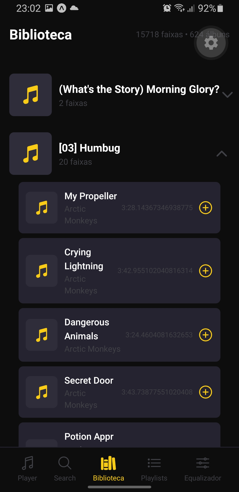
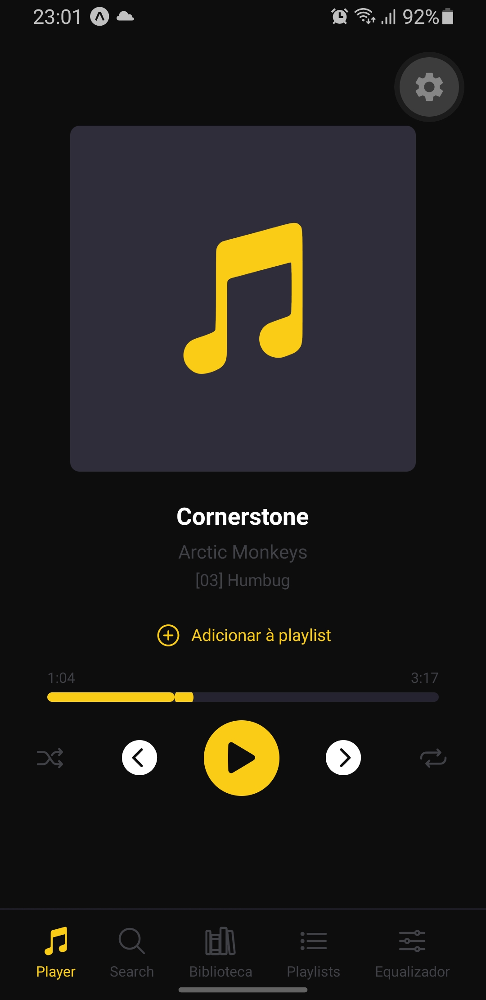
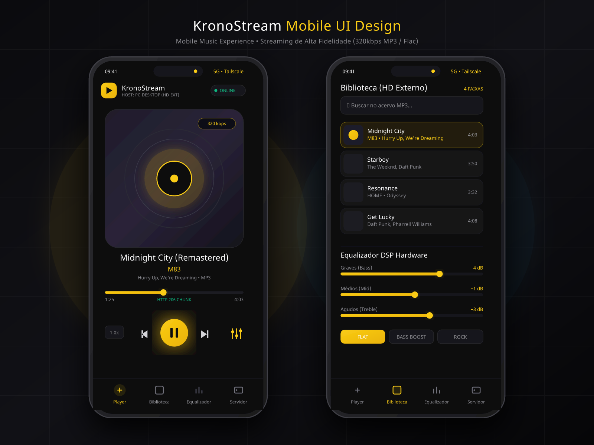
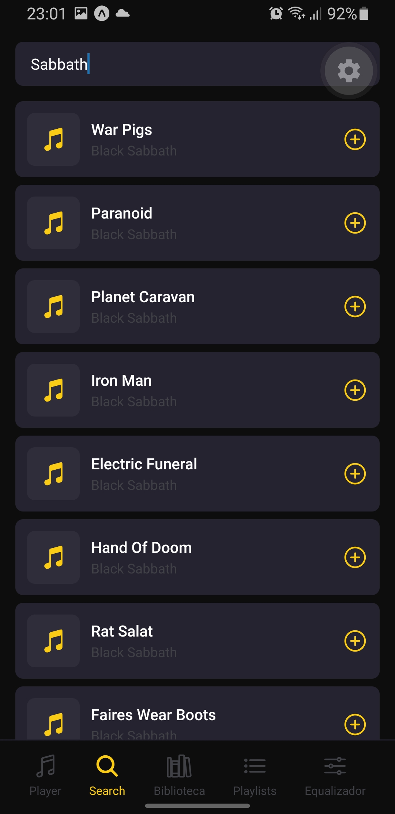
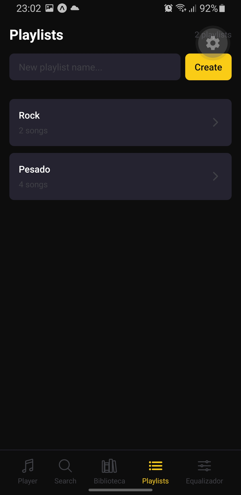

# App Music

Personal music streaming app. Stream your MP3 library from an external HD connected to your PC, accessible from anywhere via mobile.




## Architecture

Monorepo with hexagonal architecture — backend Fastify + React Native (Expo) mobile app, communicating via HTTP.



```
app-music/
├── apps/
│   ├── server/          # Fastify backend
│   └── mobile/          # React Native app (Expo)
├── shared/              # Zod schemas (frontend ↔ backend)
├── docs/
│   └── screens/         # App screenshots
├── biome.json           # Linting & formatting
├── lefthook.yml         # Git hooks
└── pnpm-workspace.yaml
```

## Tech Stack

| Layer | Technology |
|-------|-----------|
| **Package manager** | pnpm workspaces |
| **Linting** | Biome |
| **Backend** | Fastify, Drizzle ORM, better-sqlite3, music-metadata |
| **Mobile** | Expo SDK 57, React Native, NativeWind, expo-audio |
| **Validation** | Zod (shared schemas) |
| **State** | TanStack Query v5 |
| **Testing** | Vitest, React Testing Library |

## Getting Started

### Prerequisites

- Node.js 20+
- pnpm 10+

### Install

```bash
pnpm install
```

### Backend

```bash
cd apps/server
cp .env.example .env    # configure MUSIC_DIR, PORT
pnpm dev
```

Server runs on `http://localhost:3000` by default.

### Mobile

```bash
cd apps/mobile
cp .env.example .env    # set EXPO_PUBLIC_API_BASE
pnpm start
```

Scan the QR code with Expo Go (Android) or Camera (iOS).

> **Note:** Must use `--lan` mode. Tunnel mode is not supported.

### Environment Variables

**Server** (`apps/server/.env`):
| Variable | Default | Description |
|----------|---------|-------------|
| `MUSIC_DIR` | — | Path to MP3 directory |
| `PORT` | `3000` | Server port |

**Mobile** (`apps/mobile/.env`):
| Variable | Description |
|----------|-------------|
| `EXPO_PUBLIC_API_BASE` | Server URL (e.g. `http://192.168.0.104:3000`) |

## Features




- **Music library** — browse all tracks grouped by album
- **Streaming** — stream MP3s with 30s forward buffer and prefetch
- **Search** — real-time search with recent search history
- **Playlists** — create, edit, add/remove songs
- **Equalizer** — native Android equalizer with 5 presets
- **Cover art** — album art fetched from backend with local cache
- **Auto-advance** — playlist-aware next/prev with infinite scroll

## Testing

```bash
# Backend
cd apps/server && pnpm test

# Mobile
cd apps/mobile && pnpm test

# All
pnpm -r test
```

## Code Quality

```bash
pnpm check        # Biome lint + format
pnpm typecheck    # TypeScript
```

Git hooks (via Lefthook):
- **pre-commit** — `biome check`
- **pre-push** — typecheck + tests
